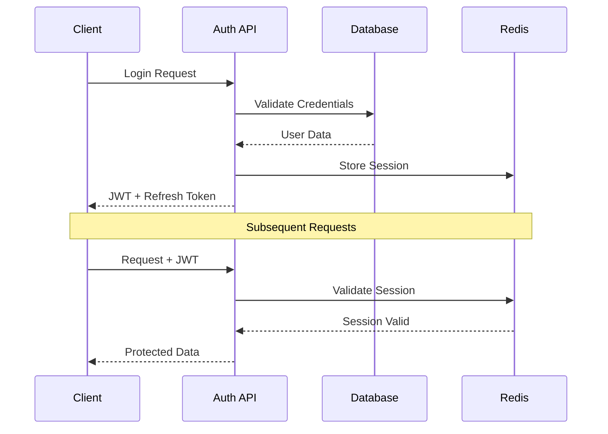

# EDUVEXA Technical Architecture

This document outlines the comprehensive technical architecture for transforming EDUVEXA into a production-ready educational collaboration platform.

---

## 🏗️ System Architecture Overview

```
┌─────────────────────────────────────────────────────────┐
│                    CLIENT LAYER                          │
├─────────────────────────────────────────────────────────┤
│  Next.js Frontend (React + TypeScript + Tailwind)       │
│  ├── Dashboard Components                               │
│  ├── Real-time Updates (WebSocket)                      │
│  ├── State Management (React Context/Zustand)           │
│  └── API Client (Axios with interceptors)              │
└─────────────────────────────────────────────────────────┘
                              │
                              ▼
┌─────────────────────────────────────────────────────────┐
│                    API LAYER                             │
├─────────────────────────────────────────────────────────┤
│  Next.js API Routes + Middleware                        │
│  ├── Authentication (JWT + Refresh Tokens)              │
│  ├── Authorization (RBAC)                               │
│  ├── Rate Limiting                                      │
│  ├── Request Validation (Zod)                           │
│  └── Response Standardization                           │
└─────────────────────────────────────────────────────────┘
                              │
                              ▼
┌─────────────────────────────────────────────────────────┐
│                   BUSINESS LOGIC                          │
├─────────────────────────────────────────────────────────┤
│  Service Layer                                           │
│  ├── User Service (Profile, Gamification)               │
│  ├── Project Service (Tasks, Teams)                     │
│  ├── Feedback Service (Analytics, Moderation)           │
│  ├── Analytics Service (Reports, Insights)              │
│  ├── Notification Service (Real-time)                    │
│  └── Report Service (PDF/CSV Generation)                 │
└─────────────────────────────────────────────────────────┘
                              │
                              ▼
┌─────────────────────────────────────────────────────────┐
│                    DATA LAYER                             │
├─────────────────────────────────────────────────────────┤
│  PostgreSQL (Primary Database)                           │
│  ├── User Management & Authentication                    │
│  ├── Projects, Tasks, Teams                             │
│  ├── Feedback & Analytics                               │
│  └── Audit Logs & History                               │
│                                                          │
│  Redis (Caching & Session Store)                         │
│  ├── Session Management                                 │
│  ├── Real-time Data Cache                               │
│  ├── Leaderboard & Analytics Cache                      │
│  └── Rate Limiting                                      │
└─────────────────────────────────────────────────────────┘
```

---

## 🔧 Core Technologies

### Frontend Stack
- **Framework**: Next.js 14 (App Router)
- **Language**: TypeScript
- **Styling**: Tailwind CSS + Professional Design System
- **State Management**: React Context + Zustand
- **Forms**: React Hook Form + Zod validation
- **Charts**: Recharts / Chart.js
- **Real-time**: WebSocket (Socket.io)
- **File Upload**: Uploadthing / AWS S3

### Backend Stack
- **Runtime**: Node.js
- **Framework**: Next.js API Routes
- **Database**: PostgreSQL 15+
- **ORM**: Prisma
- **Caching**: Redis
- **Authentication**: NextAuth.js + JWT
- **File Storage**: AWS S3 / CloudFront
- **Email**: Resend / SendGrid

### DevOps & Infrastructure
- **Containerization**: Docker + Docker Compose
- **Deployment**: AWS (ECS/RDS/ElastiCache) or Azure
- **CI/CD**: GitHub Actions
- **Monitoring**: DataDog / New Relic
- **Logging**: Winston + ELK Stack
- **CDN**: CloudFlare

---

## 📡 API Architecture

### RESTful API Structure
```
/api/v1/
├── auth/
│   ├── login
│   ├── logout
│   ├── register
│   └── refresh
├── users/
│   ├── profile
│   ├── [id]
│   └── search
├── projects/
│   ├── [id]
│   ├── [id]/tasks
│   └── [id]/teams
├── feedback/
│   ├── give
│   ├── receive
│   └── analytics
├── analytics/
│   ├── dashboard
│   ├── reports
│   └── export
├── notifications/
│   ├── list
│   ├── mark-read
│   └── settings
├── gamification/
│   ├── badges
│   ├── leaderboard
│   └── progress
└── discussions/
    ├── threads
    ├── [id]/comments
    └── search
```

### WebSocket Events
```typescript
// Real-time events
interface SocketEvents {
  // Notifications
  'notification:new': (notification: Notification) => void;
  'notification:read': (id: string) => void;
  
  // Collaboration
  'discussion:new': (thread: DiscussionThread) => void;
  'discussion:reply': (comment: DiscussionComment) => void;
  'task:updated': (task: Task) => void;
  
  // Gamification
  'badge:earned': (badge: UserBadge) => void;
  'level:up': (level: number) => void;
  'streak:updated': (streak: number) => void;
  
  // Analytics
  'engagement:updated': (metrics: EngagementMetrics) => void;
}
```

---

## 🔐 Security Architecture

### Authentication Flow


### Authorization (RBAC)
```typescript
interface RolePermissions {
  STUDENT: [
    'view:own-profile',
    'view:own-projects',
    'give:feedback',
    'receive:feedback',
    'participate:discussions'
  ];
  
  INSTRUCTOR: [
    ...STUDENT,
    'view:all-students',
    'manage:projects',
    'view:analytics',
    'create:interventions',
    'moderate:feedback'
  ];
  
  ADMIN: [
    ...INSTRUCTOR,
    'manage:users',
    'system:settings',
    'view:system-analytics'
  ];
}
```

### Security Measures
- **Input Validation**: Zod schemas for all inputs
- **SQL Injection Prevention**: Prisma ORM
- **XSS Protection**: Content Security Policy
- **Rate Limiting**: Redis-based rate limiting
- **CORS**: Proper origin configuration
- **Data Encryption**: Sensitive data encryption at rest
- **Audit Logging**: All actions logged with user context

---

## 📊 Data Architecture

### Database Design Principles
1. **Normalization**: 3NF for data integrity
2. **Performance**: Strategic indexing for queries
3. **Scalability**: Partitioning for large tables
4. **Backup**: Point-in-time recovery
5. **Migration**: Version-controlled schema changes

### Caching Strategy
```typescript
interface CacheStrategy {
  // User Sessions
  'session:{userId}': {
    ttl: 24 * 60 * 60; // 24 hours
    type: 'user-session';
  };
  
  // Leaderboard
  'leaderboard:{timeRange}': {
    ttl: 5 * 60; // 5 minutes
    type: 'leaderboard';
  };
  
  // Analytics
  'analytics:dashboard:{userId}': {
    ttl: 10 * 60; // 10 minutes
    type: 'user-analytics';
  };
  
  // Notifications
  'notifications:unread:{userId}': {
    ttl: 60; // 1 minute
    type: 'notifications';
  };
}
```

---

## 🚀 Performance Optimization

### Frontend Optimization
- **Code Splitting**: Route-based and component-based
- **Lazy Loading**: Components and images
- **Caching**: Service workers for static assets
- **Bundle Optimization**: Tree shaking and minification
- **Image Optimization**: Next.js Image component
- **Font Optimization**: Google Fonts with display: swap

### Backend Optimization
- **Database Query Optimization**: Index usage analysis
- **Connection Pooling**: PgBouncer for PostgreSQL
- **API Response Caching**: Redis for frequent queries
- **Compression**: Gzip/Brotli for responses
- **CDN**: CloudFlare for static assets
- **Load Balancing**: Application load balancer

### Monitoring & Analytics
```typescript
interface PerformanceMetrics {
  // Application Metrics
  responseTime: number;
  errorRate: number;
  throughput: number;
  
  // Database Metrics
  queryTime: number;
  connectionPool: number;
  indexUsage: number;
  
  // User Metrics
  activeUsers: number;
  engagementRate: number;
  featureUsage: Record<string, number>;
}
```

---

## 🔄 CI/CD Pipeline

### GitHub Actions Workflow
```yaml
name: EDUVEXA CI/CD

on:
  push:
    branches: [main, develop]
  pull_request:
    branches: [main]

jobs:
  test:
    runs-on: ubuntu-latest
    steps:
      - uses: actions/checkout@v3
      - uses: actions/setup-node@v3
      - run: npm ci
      - run: npm run lint
      - run: npm run test
      - run: npm run test:e2e

  build:
    needs: test
    runs-on: ubuntu-latest
    steps:
      - uses: actions/checkout@v3
      - run: npm ci
      - run: npm run build
      - run: docker build -t eduvexa .

  deploy:
    needs: build
    runs-on: ubuntu-latest
    if: github.ref == 'refs/heads/main'
    steps:
      - name: Deploy to Production
        run: |
          # Deployment script
          docker push ${{ secrets.REGISTRY }}/eduvexa
          kubectl apply -f k8s/
```

---

## 📈 Scalability Architecture

### Horizontal Scaling
- **Application**: Multiple containers behind load balancer
- **Database**: Read replicas for read-heavy operations
- **Cache**: Redis Cluster for distributed caching
- **File Storage**: CDN + distributed object storage

### Microservices Evolution Path
```typescript
// Phase 1: Monolith (Current)
// Single Next.js application with all features

// Phase 2: Service Layer
// Separate service modules within the same application

// Phase 3: Microservices
// Independent services for different domains:
// - User Service
// - Project Service  
// - Analytics Service
// - Notification Service
// - Report Service
```

---

## 🔧 Development Workflow

### Local Development
```bash
# Development Environment
docker-compose up -d  # PostgreSQL + Redis
npm run dev          # Next.js development server
npm run db:push      # Database migrations
npm run db:seed      # Seed data

# Testing
npm run test         # Unit tests
npm run test:e2e     # End-to-end tests
npm run lint         # Code quality
```

### Code Quality
- **TypeScript**: Strict mode enabled
- **ESLint**: Custom rules for consistency
- **Prettier**: Code formatting
- **Husky**: Pre-commit hooks
- **Conventional Commits**: Standardized commit messages

---

## 📊 Monitoring & Observability

### Application Monitoring
```typescript
interface MonitoringSetup {
  // Application Performance Monitoring
  apm: {
    service: 'DataDog' | 'New Relic';
    customMetrics: boolean;
    distributedTracing: boolean;
  };
  
  // Error Tracking
  errorTracking: {
    service: 'Sentry';
    captureExceptions: boolean;
    captureBreadcrumbs: boolean;
  };
  
  // Logging
  logging: {
    level: 'info' | 'debug' | 'warn' | 'error';
    format: 'json' | 'text';
    destination: 'console' | 'file' | 'elasticsearch';
  };
}
```

### Health Checks
```typescript
// /api/health endpoint
interface HealthCheck {
  status: 'healthy' | 'degraded' | 'unhealthy';
  timestamp: string;
  services: {
    database: 'connected' | 'disconnected';
    redis: 'connected' | 'disconnected';
    storage: 'available' | 'unavailable';
  };
  metrics: {
    uptime: number;
    memory: number;
    cpu: number;
  };
}
```

---

## 🌐 Deployment Architecture

### Production Environment
```yaml
# Docker Compose Production
version: '3.8'
services:
  app:
    image: eduvexa:latest
    replicas: 3
    environment:
      - NODE_ENV=production
      - DATABASE_URL=${DATABASE_URL}
      - REDIS_URL=${REDIS_URL}
    
  database:
    image: postgres:15
    environment:
      - POSTGRES_DB=eduvexa_prod
    volumes:
      - postgres_data:/var/lib/postgresql/data
    
  redis:
    image: redis:7-alpine
    command: redis-server --appendonly yes
    volumes:
      - redis_data:/data
      
  nginx:
    image: nginx:alpine
    ports:
      - "80:80"
      - "443:443"
    volumes:
      - ./nginx.conf:/etc/nginx/nginx.conf
```

### Infrastructure as Code
- **Terraform**: AWS/Azure resource management
- **Kubernetes**: Container orchestration
- **Helm Charts**: Application deployment
- **Ansible**: Configuration management

---

This technical architecture provides a scalable, secure, and maintainable foundation for EDUVEXA's transformation into a comprehensive educational collaboration platform. The architecture supports current requirements while allowing for future growth and feature expansion.
